# Lab 1: Setup Hybrid Identity with On-Prem AD and Entra ID

## Lab Overview 
This lab focuses on setting up a hybrid identity solution using on-premises Active Directory (AD) and Microsoft Entra ID. It guides users through the process of configuring Active Directory on a Windows Server, adding users/groups to the domain controller, and configuring directory synchronization with Microsoft Entra Connect to sync identities between on-premises AD and Entra ID.

## Lab Scenario
In this lab scenario, you are tasked with setting up a hybrid identity solution to seamlessly manage user identities across on-premises and cloud environments. By configuring Active Directory on a Windows Server, adding users/groups, and setting up directory synchronization with Microsoft Entra Connect, organizations can achieve centralized identity management and enable single sign-on capabilities for their users.

## Lab objectives
In this lab, you will perform the following:

- Task 1: Active Directory Setup
- Task 2: Adding users or groups in your Domain Controller
- Task 3: Configure directory synchronization with Entra ID Connect
- Task 4: Verify synchronization in Entra ID

## Estimated timing: 90 minutes

## Architecture Diagram

  

## Task 1: Active Directory Setup
In this task, you will set up Active Directory Domain Services on a Windows Server. This involves launching Server Manager, adding roles and features, selecting Active Directory Domain Services, and promoting the server to a domain controller. By completing this task, you will establish the foundation for managing users, groups, and other objects within your domain.

1. Once the VM is launched, press the Windows Logo Key and search for **Server Manager**. An application should show up on the list. Click on it to launch the program.
 
    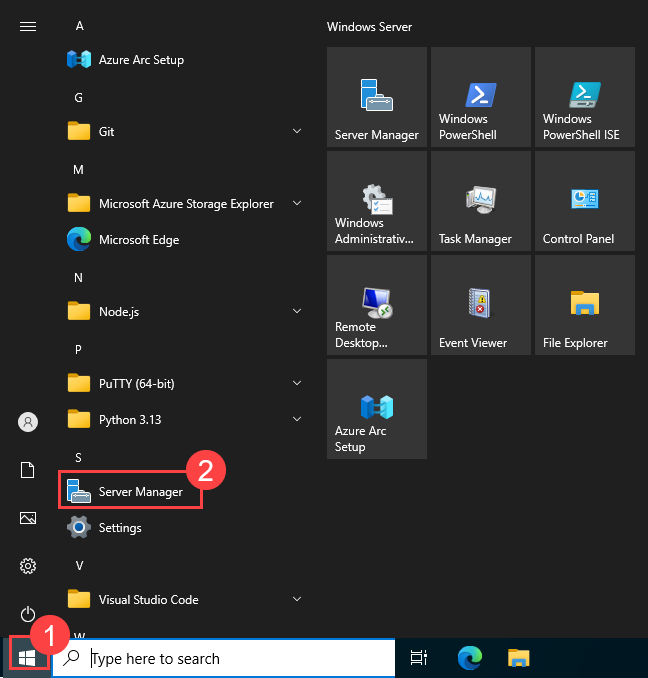
 
1. Look for **Manage** on the top right of the menu bar. Click on it and then select **Add Roles and Features**. A pop-up window will open immediately. This pop-up window is the installer wizard that guides you with the roles and features setup.

    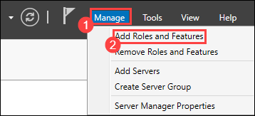
   
1. On the left side of the window, you’ll see a list of all the checkpoints you encounter in this stage. Click **Next**.

      
 
1. At the **Installation Type** checkpoint select **Role-based or feature based installation** radio button and then click **Next**.

   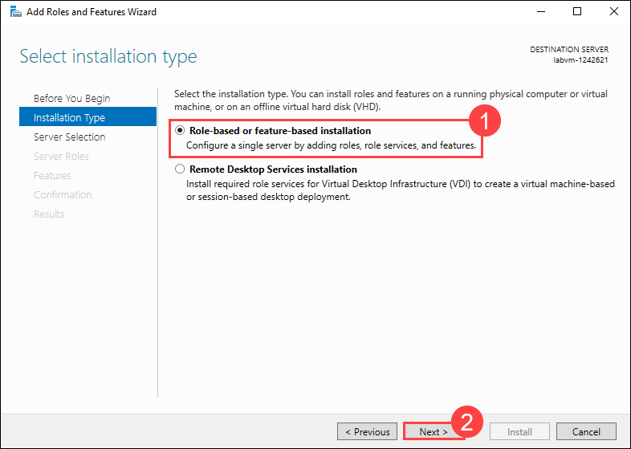
   
1. On the **Server Selection** checkpoint, select Select a **server from the server pool** radio button. This lists a server installed on your machine. Please, click on the desired server once to select it and click **Next**.

   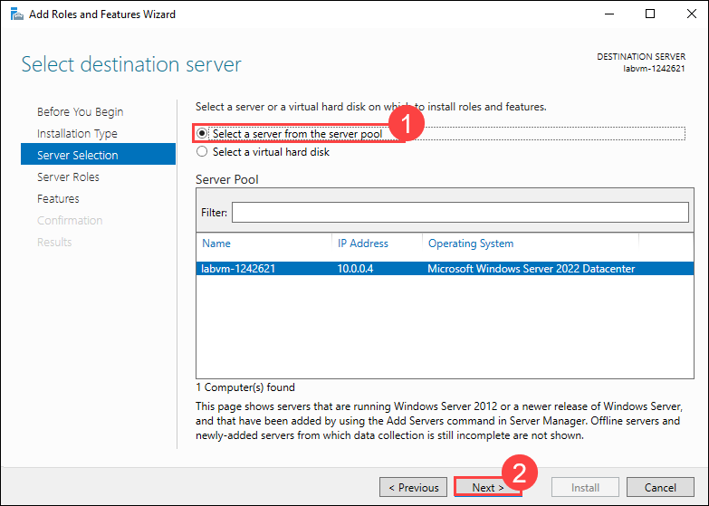
   
1. At the **Select Server Roles** checkpoint, select the role for the server. In the centre of the window, there is a list of all the roles that you can assign to your server machine. Search for **Active Directory Domain Services**.

   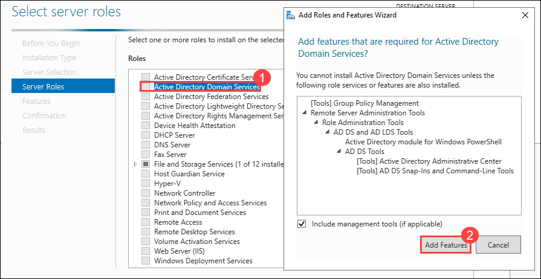
   
1. Next, a pop-up window will be displayed. This is the checkpoint for adding new features. Navigate on the **Add features** button at the bottom of the window and a list of available features will be displayed.
   
1. Next simply click **next** without making modifications to any other settings.

   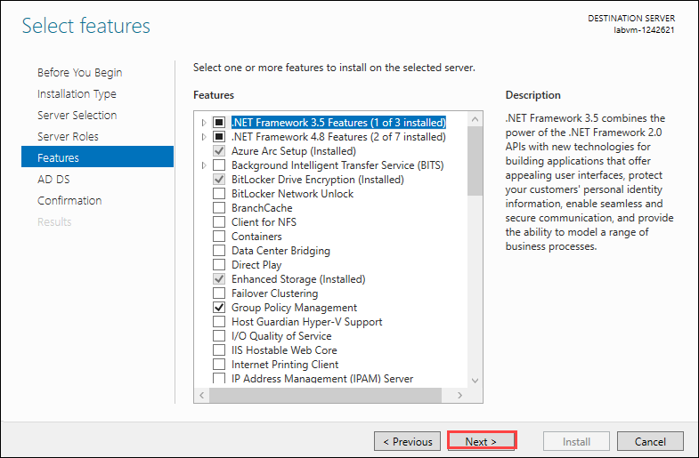 
  
1. You will be redirected to the adding **Active Directory Domain Services** feature once the previous step is complete. On the installer wizard window, click **Next**.

   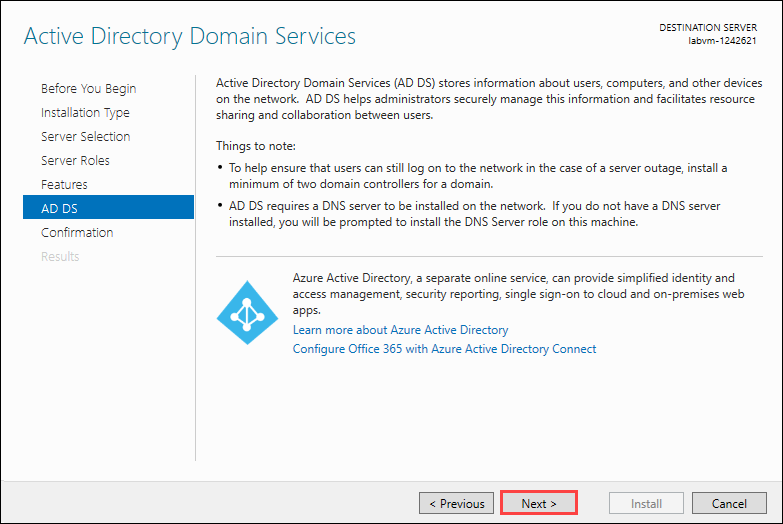
    
1. You’ll see a summary of your selected options here. Have a look at them carefully, and if you think you’ve made a mistake at any of the earlier checkpoints, you can go back and fix it by clicking “previous.” Then, click **Install** button, once you’re satisfied with your selections at the “Confirmation” checkpoint.

   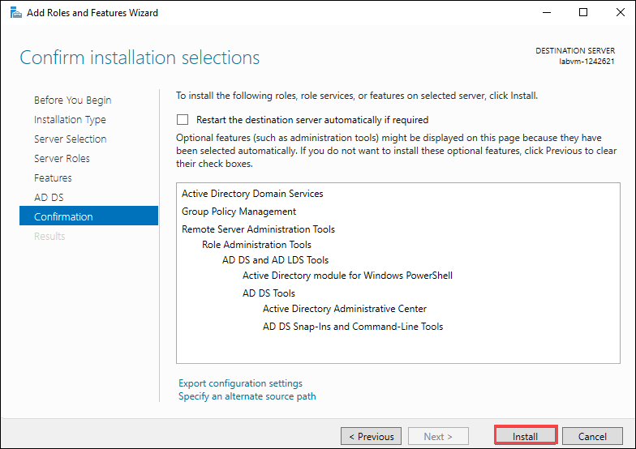 
  
1. The wizard will then begin installation. The time of install depends on your machine’s hardware configuration and what features you’ve selected to be installed. Please make sure not to interrupt the installation. Once the installation is complete, click the **Close** button.

  
1. Relaunch **Server Manager** if you have already closed it. On your Server Manager dashboard, you’ll should see a yellow triangle warning sign on the top right of the window near the menu bar. This sign appears only if Active Directory Domain Services was properly installed.

       
1. Click on the warning sign and a dropdown list will show you the required actions termed **post-deployment configuration**.
   
1. Look for the **Promote this server to a domain controller** option and click on it.

   
 
1. At the first checkpoint “Deployment Configuration”, please select the **add a new forest** radio button and enter your root domain name as **Contoso.local**. Then click **next**.

    

1. At the “Domain Controller Options” checkpoint, leave all the settings untouched and enter your password and confirm it. Make sure to keep a note of this password as changing it later on is troublesome.

   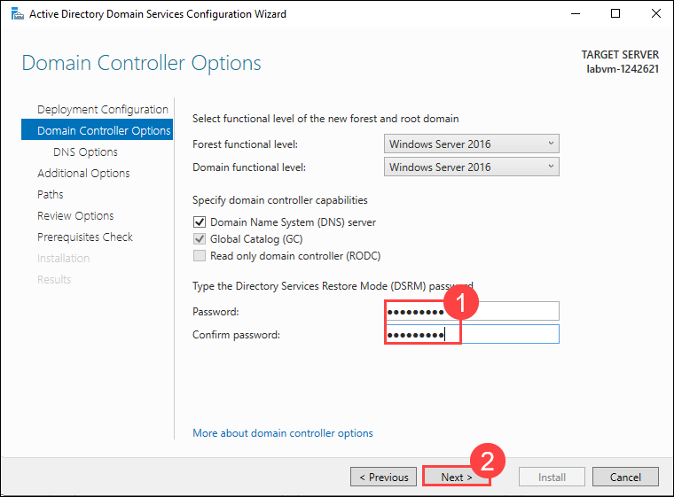
 
1. On the DNS Options page, you’l see an error message stating that there’s no parent zone found and no delegation for your DNS server could be created. Ignore this message and click the **next** button, leaving all the settings at this checkpoint unchanged.

   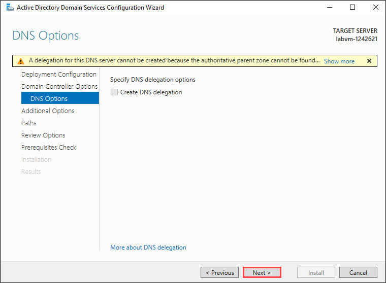

1. On the Additional Options page, enter your desired NetBIOS domain name in the given textbox. Click **Next**.

   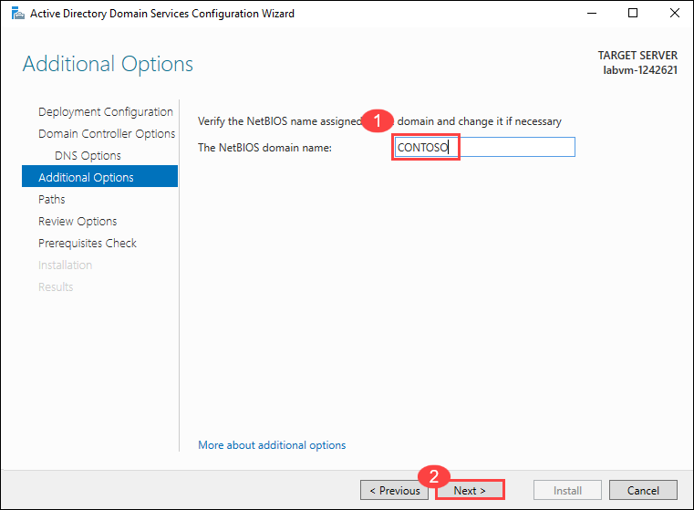

1. Three or more paths will be listed on your screen. Do not change these paths. You’re not required to keep a note of these paths either. Click **next**.

   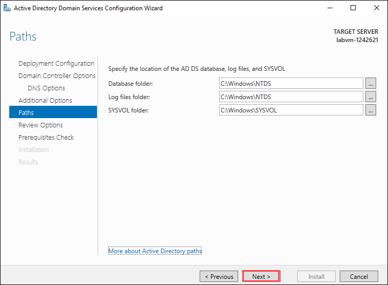

1. Whatever options you’ve selected so far will listed on the configuration wizard at this checkpoint. Have a look at them and if needed, move to the previous checkpoints using the “previous” button and make the desired changes. Once you’re satisfied with the selected options, click **next** on the “Review Options”.

   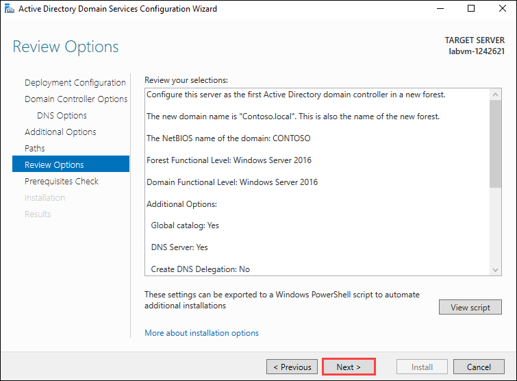

1. Next, head to the “Prerequisites Check” checkpoint. At this stage you’ll see, if all the prerequisite checks were successfully completed. If not, then a list of errors will be displayed on the window. If there are any errors, you’ll need to go to the stated checkpoint and fix the errors. Once you’ve fixed all the errors, a green check mark with a success message will be displayed. Then click **Install** to begin the installation.

   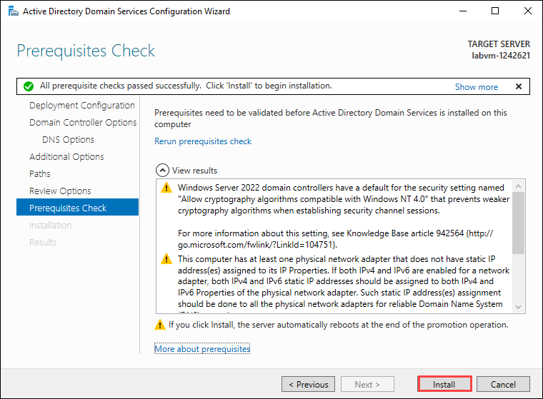

1. Congratulations! You have successfully set up Active Directory on your Windows Server. Next, your server machine will restart once the promotion is successfully completed. You will lose the access to the LabVM for a while until restarts completes.

## Task 2: Adding users or groups in your Domain Controller
In this task, you will add user accounts to the domain controller in Active Directory Users and Computers. You will create new user accounts with specified names, usernames, and passwords. By adding users to the domain controller, you will ensure that they have access to resources within the domain and can authenticate against Active Directory.

1. Go to Start > Windows Administrative Tools > Active Directory Users and Computers.

   

1. In a new Desktone hosted Domain controller, Expand the folder which represents the domain and expand the **Users** folder.

   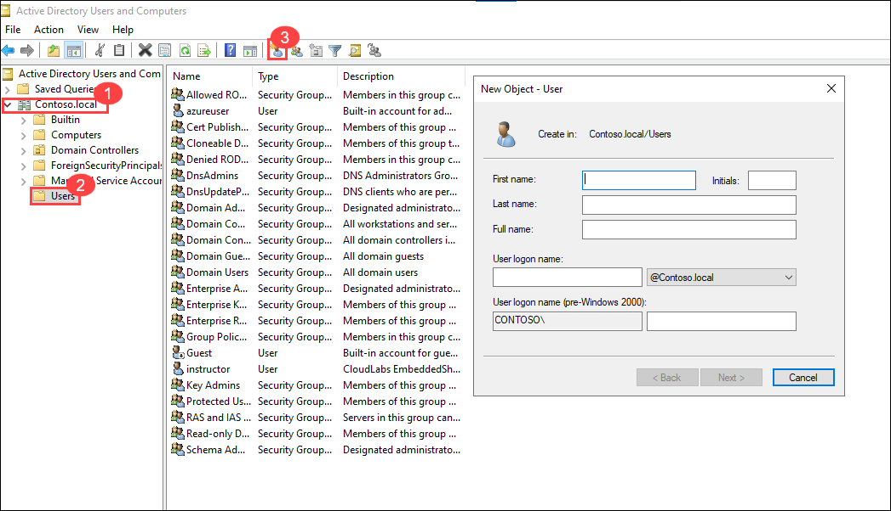

1. To create a new user, Click **user icon** and create the users with the following info.

      | Name           | User Name                | Password   | 
      | -------------- | ------------------------ | ---------- |
      | Edmund Reeve   | `ereeve@Contoso.local`   | Pa55-w.rd! |
      | Miranda Snider | `msnider@Contoso.local`  | Pa55-w.rd! | 
      | Allan Deyoung  | `AllanD@Contoso.local`   | Pa55-w.rd! | 
      | Joni Sherman   | `JoniS@Contoso.local`    | Pa55-w.rd! | 

1. Please find the below images indicating the user creation process. Repeat these steps to create all users.
    
    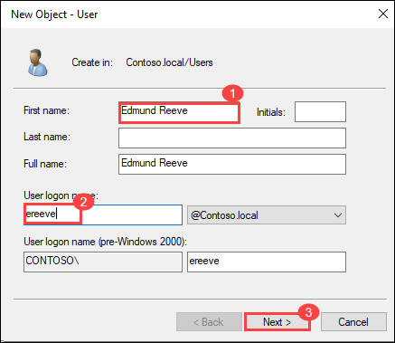
  
    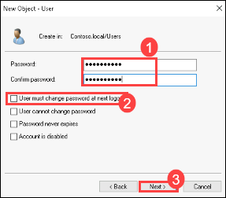

    >**Note:** Make sure to uncheck the **User must change the Password at next logon** setting
  
    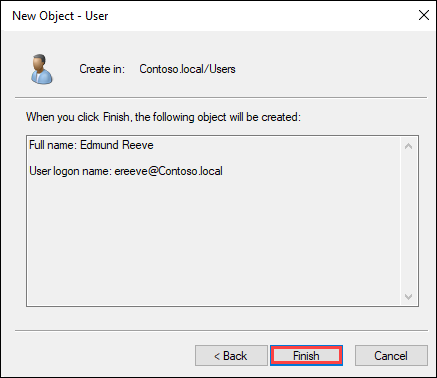

## Task 3: Configure directory synchronization with Microsoft Entra Connect
In this task, you will configure directory synchronization between your on-premises Active Directory and Microsoft Entra ID using Entra Connect. This involves downloading and installing Azure AD Connect, providing necessary credentials for synchronization, and configuring synchronization options. By completing this task, you will enable the seamless synchronization of user identities between on-premises AD and Entra ID.

1. On the taskbar, select **Microsoft Edge**.

1. In the address bar, enter `https://www.microsoft.com/en-us/download/details.aspx?id=47594`.

1. On the Microsoft Entra connect, select **Download**. 

   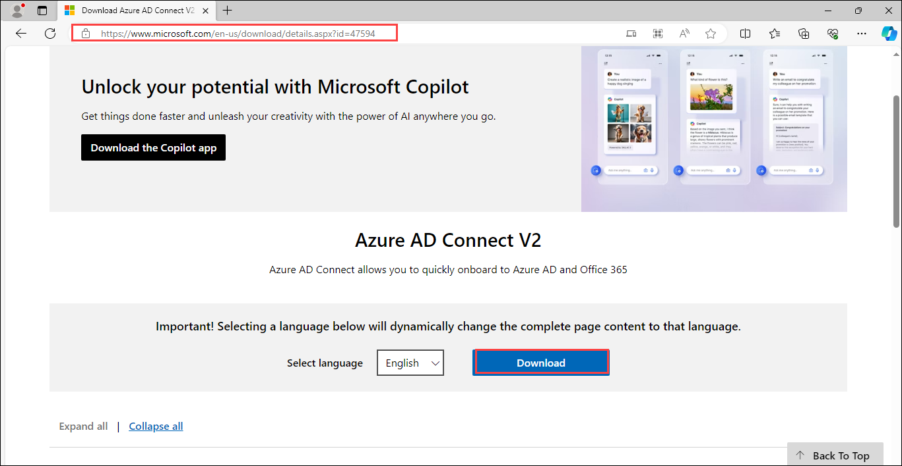

1. Select **Open downloads folder** and then in the **Downloads** window, double-click **AzureADConnect.msi**.

1. In the **Microsoft Azure Active Directory Connect** wizard, on the **Welcome to Azure AD Connect** page, select the **I agree to the license terms and privacy notice** check box, and then select **Continue**.

   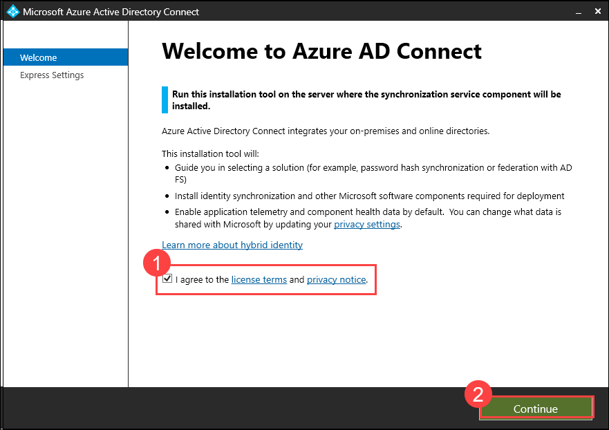

1. On the **Express Settings** page, select **Use express settings**.

   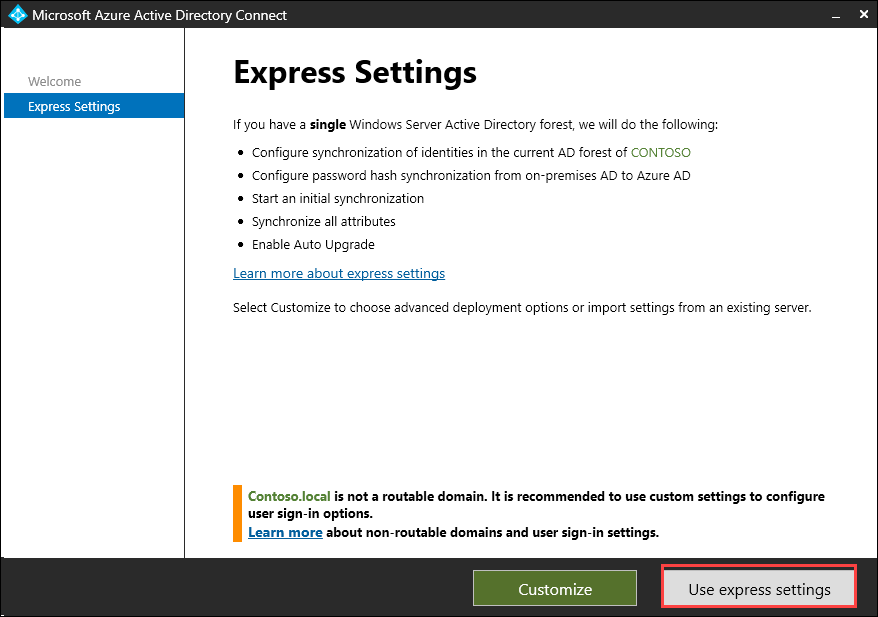

1. On the **Connect to Azure AD** page, in the **USERNAME** and **PASSWORD** boxes, enter **<inject key="AzureAdUserEmail"></inject>**, and your provided password **<inject key="AzureAdUserPassword"></inject>**, and then select **Next**.

   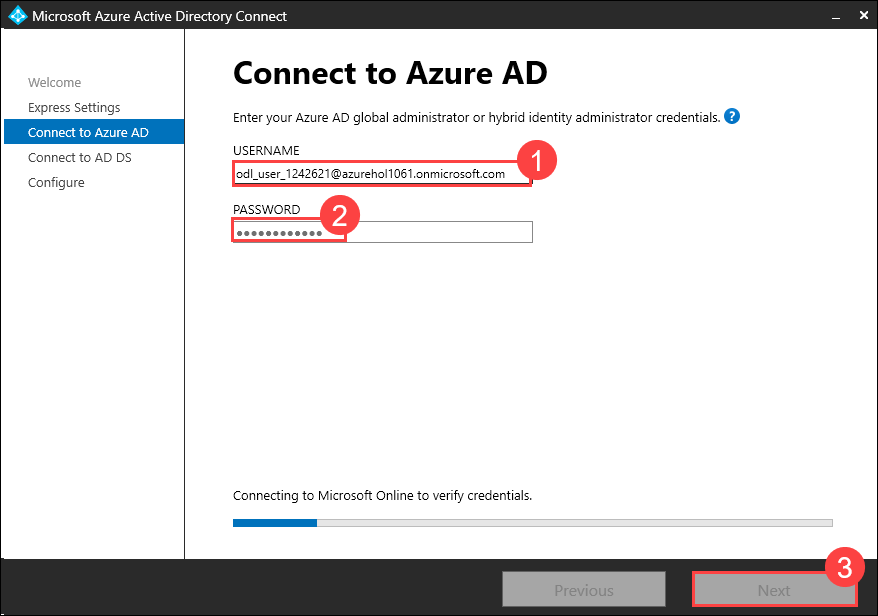

1. On the **Connect to Azure AD DS** page, in the **USERNAME** and **PASSWORD** boxes, enter **CONTOSO\azureuser**, and your provided password **<inject key="LabVM Admin Password"></inject>**, and then select **Next**.

   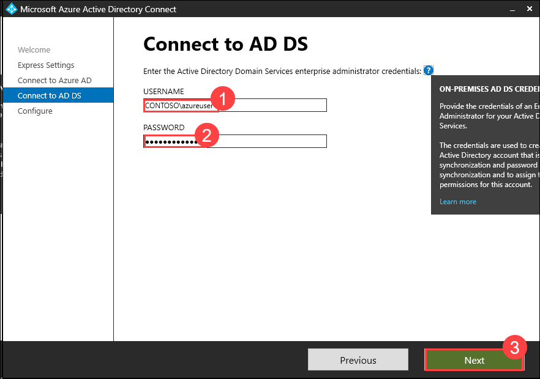

1. On the **Azure AD sign-in configuration** page, select **Continue without matching all UPN suffixes to verified domains** checkbox and then select **Next**.

   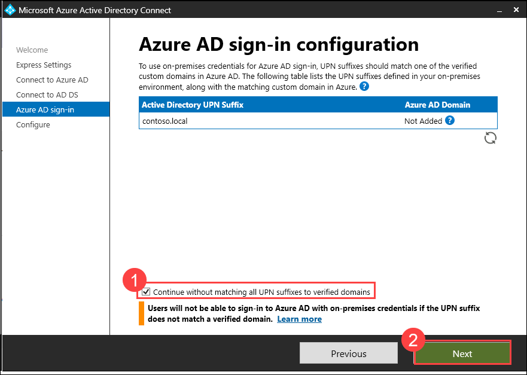

1. On the **Ready to configure** page, ensure that **Start the synchronization process when configuration completes** is selected, and then select **Install**.

   

1. When configuration is complete, select **Exit**.  

   
      > Note: At this time, synchronization of objects from your local Active Directory Domain Services (AD DS) and Azure AD begins. You should wait approximately 3-4 minutes for this process to complete.

1. Close all open windows.

## Task 4: Verify synchronization in Entra ID
In this task, you will verify the synchronization of identities in Azure Active Directory. You will access the Microsoft 365 admin center, navigate to the Identity section, and verify that user accounts synchronized from on-premises AD are visible in Entra ID. By confirming successful synchronization, you will ensure that users can access cloud-based resources using their on-premises credentials.

1. On the taskbar, select **Microsoft Edge**.

1. In the address bar, enter **https://admin.microsoft.com**.

1. At the Sign-in prompt, enter **<inject key="AzureAdUserEmail"></inject>** and then select **Next**.

1. At the Enter password page, enter the password for the Admin account as **<inject key="AzureAdUserPassword"></inject>** and then select **Sign in**. 

1. At the More information required prompt, select **Next**.

1. On the **keep you account secure** page, select **Next** twice.

   Note:- If you don't have the **Authenicator** app installed on your mobile then, open Play Store / App store and search for **Microsoft Authenticator** and tap **Install**.

1. Scan the **QR code** in you **Authenticator** app and select **Next**.

   

1. Now enter the number shown on your screen in the authenticator app and select **Next.**

   Note:- It you are asked to enter your **Mobile Number**, close the browser and login in **InPrivate Window**.

1. At the Save password prompt, select **Save**.

1. At the Stay signed in prompt, select **No**. The Microsoft 365 admin center opens.

1. Select the **Navigation menu** and then select **Show all**.

1. In the Navigation pane, under **Admin centers** select **Identity**. The Microsoft Entra admin center opens.

1. In the Microsoft Entra admin center, in the navigation pane, select **Users** > **All users**. 

   

1. Close Microsoft Edge.

> **Congratulations** on completing the task! Now, it's time to validate it. Here are the steps:
> - Click the Lab Validation tab located at the upper right corner of the lab guide section and navigate to the Lab Validation Page.
> - Hit the Validate button for the corresponding task. If you receive a success message, you can proceed to the next task. 
> - If not, carefully read the error message and retry the step, following the instructions in the lab guide.
> - If you need any assistance, please contact us at labs-support@spektrasystems.com. We are available 24/7 to help you out.

**Results**: After completing this exercise, you will have successfully configured Azure AD Connect to synchronize identity from Active Directory Domain Services to Azure Active Directory.

