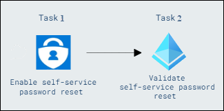

# Lab 2: Configuring Self-service password reset for user accounts in Entra ID

## Lab Overview 

This lab focuses on enabling self-service password reset with authentication methods via Microsoft Entra Admin Center, and validating by changing a password via the My Account page in Microsoft Edge.

## Lab Scenario

In this lab scenario, you are tasked with setting up self-service password reset in Entra ID, employees can securely reset their passwords without IT intervention, improving productivity and enhancing security and user experience.

## Lab objectives

In this lab, you will perform the following:

- Task 1: Enable self-service password reset
- Task 2: Validate self-service password reset

## Estimated timing: 40 mins

## Architecture Diagram

  

### Task 1: Enable self-service password reset

In this task, you'll enable self-service password reset (SSPR) for all users in Microsoft Entra ID. You'll configure the necessary authentication methods, including mobile phone, email, and security questions, allowing users to reset their passwords independently. 

1. On the taskbar select **Microsoft Edge**, in the address bar type **https://entra.microsoft.com/**, and then press **Enter**.

2. Sign in as  **<inject key="AzureAdUserEmail"></inject>**, and use the tenant Admin password **<inject key="AzureAdUserPassword"></inject>**, If the **Stay signed in?** prompt appears, select **No**.  

   > The Microsoft Entra admin center opens.

3. In the Microsoft Entra admin center, Navigate to the Search Resources section of the site.

4. In the search box, type **password reset** and then select **Password reset**.

    

5. In the **Password reset | Properties** window, select **All** to enable self-service password reset to all users. Select **Save**.
  
    

6. On the **Password reset | Properties** blade, select **Authentication methods** under **Manage** section.

7. For the methods available to users, ensure that **Mobile Phone** and **Email** are selected, and then select **Security Questions**.

8. For the **Number of questions required to register**, select **3**.

9. For the **Number of questions required to reset**, select **3**.

10. In the **Select security questions** section, select **No security questions configured**, then select **+ Predefined**. Select three questions of your choice, and then select **Ok**.

11. Select **Save**.

12. Select **Registration** Select **No** for **Require users to register when signing in**, and the select **Save**.
    
    
 
13. Close Microsoft Edge.

### Task 2: Validate self-service password reset

In this task, you'll validate the self-service password reset (SSPR) feature by signing in with a specific user account and changing the password. You'll confirm that users can securely reset their passwords using the SSPR setup, ensuring the feature is functioning as intended.

1. On the taskbar, select **Microsoft Edge**.

2. Browse to **https://myaccount.microsoft.com**. 

3. On the **Pick an account** page, select **Use another account**.

4. On the **Sign in** page, enter **`msnider@xxxxxxx.onmicrosoft.com`** and then select **Next**.

  >**Note**: Replace xxxx with the tenantname provided.
  
5. On the **Enter password** page, enter **<inject key="AzureAdUserPassword"></inject>** or the password that you have entered and then select **Sign in**. If the Microsoft Edge prompts to save the password, select **Save**.

6. When **Action required** window prompted click on **Ask later**.
   
7. On the **My Account** page, in the navigation pane, select **Password**.

    

8. On the **Change password** page, enter the following information and then select **submit**:
     - Current password: **<inject key="AzureAdUserPassword"></inject>**
     - Create new password: **Pa55w.rd!1234**
     - Confirm new password: **Pa55w.rd!1234**

9. If Microsoft Edge prompts to save the password, select **Sumit** > **Done**.

10. Close Microsoft Edge.

**Results**: After completing this exercise, you will have successfully configured and validated self-service password reset.

## Summary 
In this lab, you will learn how to configure and validate self-service password reset (SSPR) for user accounts in Microsoft Entra ID. By enabling SSPR, users can securely reset their own passwords without needing IT support, which enhances productivity and security.

## Review
In this lab, you have completed:

- Enable self-service password reset
- Validate self-service password reset

## You have successfully completed this lab.
