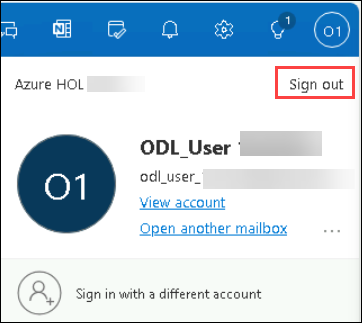
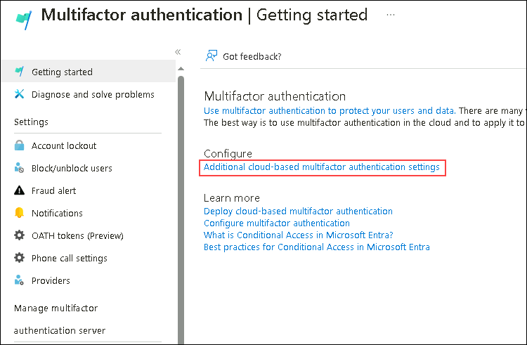
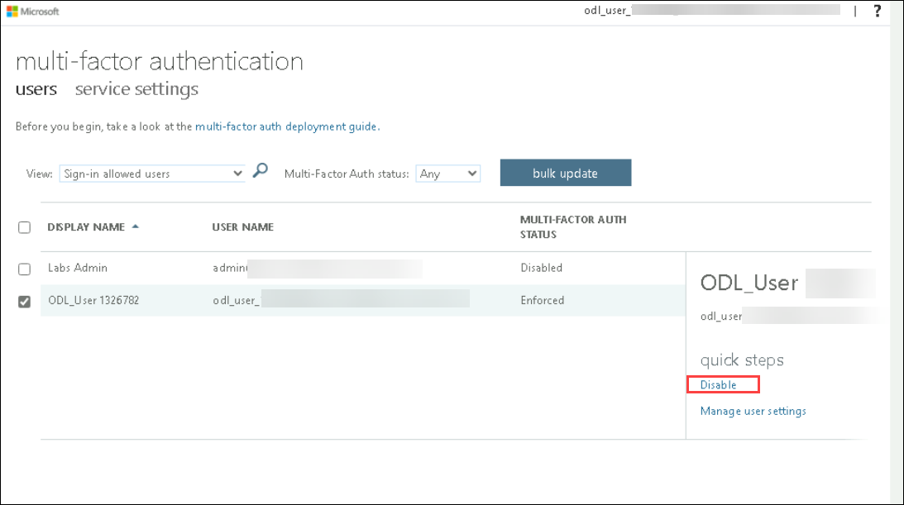
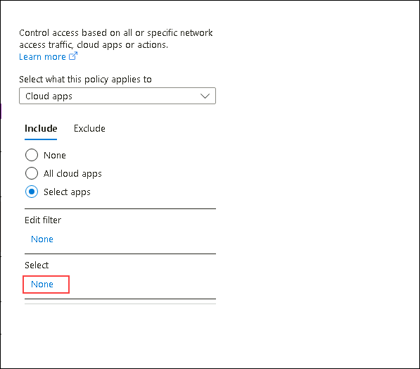
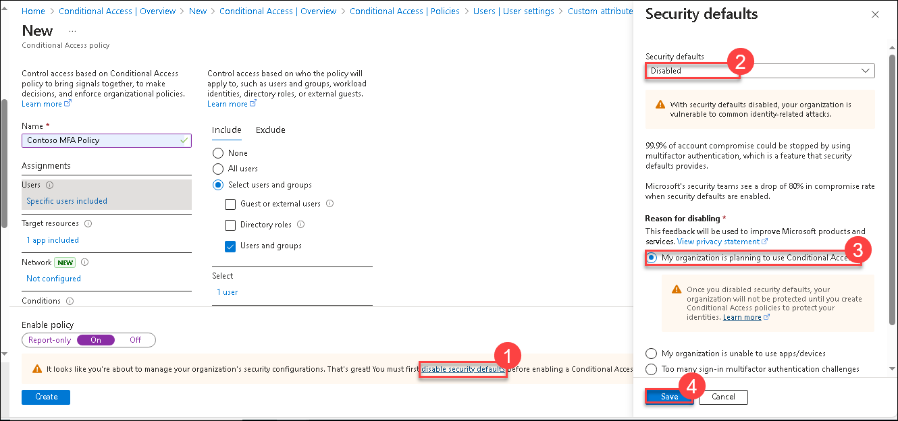
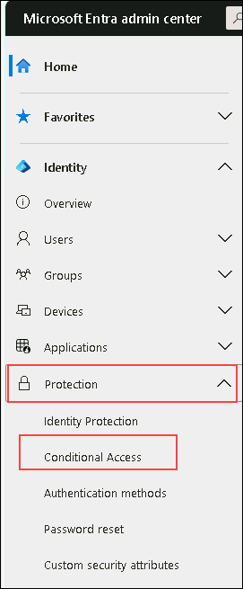

# Lab 5: Setup MFA and Conditional Access

## Lab Overview 
This lab focuses on setting up multi-factor authentication (MFA) and conditional access policies to enhance security.Initially, per-user MFA is configured for Outlook on the Web via the Microsoft Entra admin center. Then, conditional access policies with MFA are established for Office 365 apps, ensuring secure access. 

## Lab Scenario
In this lab scenario, you are tasked with setting up  heightened security measures required to safeguard sensitive data. By implementing multi-factor authentication (MFA) and conditional access policies, administrators ensure that only authorized users can access Office 365 apps securely, mitigating risks of unauthorized access and data breaches.

## Lab objectives
In this lab, you will perform the following:

- Exercise 1: Configure per-user multi-factor authentication
  - Task 1: Validate sign-in before enabling MFA
  - Task 2: Enable MFA for a user
  - Task 3: Register and Validate MFA
  - Task 4:Remove per-user MFA 
- Exercise 2: Configure multi-factor authentication using conditional access
  - Task 1: Validate sign-in before enabling conditional access with MFA
  - Task 2: Configure conditional access with MFA
  - Task 3: Validate conditional access MFA
  - Task 4: Remove conditional access MFA 

## Estimated timing: 45 mins

## Architecture Diagram

  

## Exercise 1: Configure per-user multi-factor authentication

In this exercise, you'll explore the implementation and management of multi-factor authentication (MFA) to enhance security. You'll start by validating the sign-in process without MFA, then enable and configure MFA for a user, verify its functionality, and learn how to remove MFA when it's no longer needed. 

### Task 1: Validate sign-in before enabling MFA

In this task, you are validating the current sign-in process to Outlook on the Web before enabling multi-factor authentication (MFA). You will sign in with just a password, check that MFA is not yet required, and then sign out. This ensures you understand the baseline sign-in experience before introducing MFA.

1. On the taskbar, select **Microsoft Edge**.

2. In the address bar, enter **outlook.office.com** and press Enter.
  
3. At the **Sign in** page, enter **<inject key="AzureAdUserEmail"></inject>** and then select **Next**.

4. If you are prompted to enter the password on the **Enter password** page, enter **<inject key="AzureAdUserPassword"></inject>** and select **Sign in**. At the Edge Save password prompt, select **Save & Turn on**.

5. At the **Stay signed in** prompt, select **No**.

   > Outlook on the Web opens. Take note that only the password was required to sign in to Outlook on the Web.

   >**Note:** If there is a blocker while signing in to Outlook, please wait for sometime and try signing in again.

6. At the top-right corner, select the **Account manager** and then select **Sign out**.

   

7. Close Microsoft Edge.

### Task 2: Enable MFA for a user

In this task, you will enable multi-factor authentication (MFA) for a specific user in Microsoft Entra. You’ll first access the Microsoft Entra admin center, configure MFA settings to allow users to remember trusted devices for 30 days, and then enable MFA for the selected user. After applying these changes, the user will be required to use MFA during sign-in.

1. On the taskbar select **Microsoft Edge**, in the address bar type **https://entra.microsoft.com**, and then press **Enter**.

2. Sign in as user **<inject key="AzureAdUserEmail"></inject>** and use the tenant Admin password  **<inject key="AzureAdUserPassword"></inject>**. If the **Stay signed in?** prompt appears, select **No**. 

   > The Microsoft Entra admin center opens.

3. At the top of the web page, In the search resources box, type multifactor authentication and then select **multifactor authentication**.

   > The multi-factor authentication page opens.

4. Select **Additional cloud-based multifactor authentication settings**.If prompted to sign in using at the **Sign in** page, select **<inject key="AzureAdUserEmail"></inject>**

   

6. In the **multi-factor authentication** page, select **service settings**. Select **Allow users to remember multi-factor authentication on devices they trust**.

7. Next to **Number of days users can trust devices for**, enter **30** and then select **save**. 

   

8. Close the **multi-factor authentication** page.

9. Navigate back to the **Microsoft Entra admin center** Edge tab and in the navigation pane, select **Users** > **All users**.

10. In the users list, at the top of the user list, select Per-user MFA. The Per-user MFA page opens.

    

13. In the user list, select the check box next to **<inject key="AzureAdUserEmail"></inject>**.

14. In the right navigation pane, on the **quick steps** pane, select **Enable**.

    

15. On the **About enabling multi-factor auth** message, select **enable multi-factor auth**.

16. On the **Updates successful** message, select **close**. Take note that the **Multi-Factor Auth Status** for **<inject key="AzureAdUserEmail"></inject>** is now **Enabled**.

17. Close Microsoft Edge.

### Task 3: Register and Validate MFA 

In this task, you will configure and verify multi-factor authentication (MFA) for a user. This involves setting up MFA through text messages, registering your mobile phone, and completing the verification process. You will then sign in again to ensure that MFA is functioning correctly and confirm that the setup is complete.

1. On the taskbar, select **Microsoft Edge**.

2. In the address bar, enter **outlook.office.com** and press Enter.

3. On the **Pick an account** page, select **<inject key="AzureAdUserEmail"></inject>**.

4. On the **Enter password** page, enter the password **<inject key="AzureAdUserPassword"></inject>**.

5. At the **More information required** page, select **Next**. The Keep your account secure page opens.

   > Typically, you will want to use the Microsoft Authenticator app to manage multi-factor authentication. However for this lab scenario, you will use text messages.

6. On the **Keep your account secure** page, select **I want to set up a different method**. Chose **Phone** From the dropdown menu and then click **Confirm**.

7. Enter your mobile phone number which you can receive text messages, and then select **Next**.

8. After you receive the verification code as a text message, enter the code where indicated on the **Keep your account secure** page and then select **Next**.

9. On the **Keep your account secure** page, you will receive a message "Verification complete. Your phone has been registered.". Choose **Next** to continue signing in." Select **Done**.

10. Close Microsoft Edge window.

11. Open a new Microsoft Edge window and enter **outlook.office.com** and press Enter.

12. On the **Pick an account** page, select **<inject key="AzureAdUserEmail"></inject>**.

13. On the **Enter password** page, enter the password **<inject key="AzureAdUserPassword"></inject>**.

14. On the verify your identity page choose **Text** option.Now, enter the code that you have received in your registered phone number in the form of an SMS and click **Verify**

11. At the Stay signed in message, select **No**.Outlook on the Web opens to  the odl user's inbox.

12. At the top-right corner, select the **Account manager** and then select **Sign out**.

13. Close Microsoft Edge.

### Task 4: Remove per-user MFA

In this task, you will remove multi-factor authentication (MFA) for a user. This involves accessing the Microsoft Entra admin center, navigating to the Per-user MFA settings, and disabling MFA for the specified user. 

1. On the taskbar select **Microsoft Edge**, in the address bar type **https://entra.microsoft.com**, and then press **Enter**.

2. Sign in as **<inject key="AzureAdUserEmail"></inject>**, and use the tenant Admin password **<inject key="AzureAdUserPassword"></inject>**, If the **Stay signed in?** prompt appears, select **No**. The Microsoft Entra admin center opens.

3. In the Microsoft Entra admin center, in the left navigation pane, select **Users**.

4. Select **All users** and then at the top of the results pane select **Per-user MFA**. If prompted to pick an account, choose **<inject key="AzureAdUserEmail"></inject>**. The Per-user MFA page opens.

5. In the user list, select the check box next to **<inject key="AzureAdUserEmail"></inject>**.

6. On the **quick steps** in the right pane, select **Disable**.

    

7. On the **Disable multi-factor authentication?** message, select **yes**.

8. On the **Updates successful** message, select **close**. Take note that the **Multi-Factor Auth Status** for the ODL user  is now **Disabled**.

9. Close Microsoft Edge.

**Results**: After completing this exercise, you will have successfully configured per-user multi-factor authentication.

## Exercise 2: Configure multi-factor authentication using conditional access

This exercise focuses on configuring multi-factor authentication (MFA) using conditional access in Microsoft Entra. You'll validate the current sign-in process, set up a conditional access policy to enforce MFA for Office 365 applications, and test the policy to ensure it functions correctly. Finally, you'll remove the conditional access policy, providing a comprehensive understanding of managing MFA through conditional access.

### Task 1: Validate sign-in before enabling conditional access with MFA

In this task, you validate the current sign-in process for a user before setting up conditional access with MFA. This involves signing into Outlook on the Web using only the password, confirming that MFA is not currently required, and then signing out.

1. On the taskbar, select **Microsoft Edge**.

2. In the address bar, enter **outlook.office.com** and press Enter.

4. On the **Pick an account** page, select **<inject key="AzureAdUserEmail"></inject>**

5.  If prompted to enter the password, in the **Enter password** page, enter the tenant password **<inject key="AzureAdUserPassword"></inject>** and select **Sign in**.

6. On the **Stay signed in** page, select **No**. Outlook opens to the ODL user's inbox. Take note that only the password was required to sign in to Outlook on the Web as you removed the MFA in the previous Exercise.

7. At the top-right corner, select the **Account manager** and then select **Sign out**.

8. Close Microsoft Edge.

### Task 2: Configure conditional access with MFA

In this task, you configure a conditional access policy to require multi-factor authentication (MFA) for accessing Office 365 apps. You create a new policy in the Microsoft Entra admin center, specify the user or group it applies to, and enforce MFA as part of the access controls.

1. On the taskbar select **Microsoft Edge**, in the address bar type **https://entra.microsoft.com**, and then press **Enter**.

2. Sign in as **<inject key="AzureAdUserEmail"></inject>**, and use the tenant Admin password **<inject key="AzureAdUserPassword"></inject>**. If the **Stay signed in?** prompt appears, select **No**. 

   > The Microsoft Entra admin center opens.

3. In the navigation pane, expand **Protection**, and then select **Conditional Access**.

4. On the **Conditional Access** page, select **Policies**, and then select **New policy**.

5. On the **New Conditional access policy** page, in the **Name** box, enter **Contoso MFA Policy**.

6. Under **Assignments**, select **0 users and groups selected**.

7. In the Users and groups pane, select the option next to **Select users and groups** and then select the check box next to **Users and groups**.

8. On the **Select users and groups** page, select **<inject key="AzureAdUserEmail"></inject>** and then click **Select**. 

    > Note that typically you would specify a group, however for this exercise we will just test the setting on ODL_User.

9. Select **No target resources selected** and then click **Select apps**.

    > Note the Control access based on client app setting. This setting allows you to specify the client app that is used to access the resource. For example, you can specify that only the Outlook app can be used to access Exchange Online. 

10. On the **Select** section of the page, click **None**.

    

12. On the **Select** page, search for **Office 365** and select the check box next to it and then click **Select**.

13. Under **Access controls**, in the **Grant** section, select **0 controls selected**.

14. On the **Grant** page, select **Grant access**, select the check box next to **Require multifactor authentication**, and then click **Select**.

15. Under **Enable policy**, select **On**.

16. Select **Create** to create the Contoso MFA Policy. Notice that the policy is listed with a State of **On**.

17. Close Microsoft Edge.

>**Note:** If you received any error message stating that **Security defaults must be disabled to enable conditional access policy** then click on **disable security defaults(1)** link and select **Disabled(2)** from the drop-down and select **My Organisation planning to use Conditional access(3)** then **save(4)** the changes and reperform the task again to create a policy

   

### Task 3: Validate conditional access MFA

In this task, you test the newly configured conditional access policy by signing in to Outlook on the Web and completing the MFA process to ensure that the policy is enforcing multi-factor authentication correctly.

1. On the taskbar, select **Microsoft Edge** and open an **InPrivate window**

2. In the address bar, enter **https://outlook.office.com** and press Enter.

3. On the **Pick an account** page, select **<inject key="AzureAdUserEmail"></inject>**.

5. If prompted,enter the password in the  **Enter password** page, enter the tenant password **<inject key="AzureAdUserPassword"></inject>** and select **Sign in**. 

6. At the Verify your identity prompt, select your **Text** and enter the code dialog box opens.

7. At the **Enter code** page, enter the code sent to your mobile phone, and then select **Verify**.

8. At the **Protect your account** page, select **skip for now**.

9. At the Stay signed message, select **No**. Outlook on the Web opens to the ODL user's inbox.

10. At the top-right corner, select the **Account manager** and then select **Sign out**.

11. Close Microsoft Edge.

### Task 4: Remove conditional access MFA 

In this task, you remove the previously configured conditional access policy for multi-factor authentication by deleting the policy from the Microsoft Entra admin center.

1. On the taskbar select **Microsoft Edge**, in the address bar type **https://entra.microsoft.com**, and then press **Enter**.

3. Sign in as user **<inject key="AzureAdUserEmail"></inject>**, and use the tenant Admin password **<inject key="AzureAdUserPassword"></inject>**. If the **Stay signed in?** prompt appears, select **No**. The Microsoft Entra admin center opens.

4. In the Microsoft Entra admin center, in the navigation pane, expand **Protection** and then select **Conditional Access**.

    

5. On the **Conditional Access** page, select **Policies** from the left navigation pane and then select **Contoso MFA Policy**.

6. On the **Contoso MFA Policy** page, select **Delete**.

7. At the **Are you sure?** prompt, select **Yes**.

8. Close Microsoft Edge.

**Results**: After completing this exercise, you will have successfully configured multi-factor authentication by using a conditional access policy.

## Summary 

In this lab, you set up multi-factor authentication (MFA) and conditional access policies to enhance security for Office 365 applications. You learned to configure per-user MFA, implement conditional access with MFA, and test these settings to ensure effective security enforcement. This lab provides practical experience in managing access controls to safeguard sensitive data and maintain a secure user environment.

## Review
In this lab, you have completed:

- Configure per-user multi-factor authentication
- Validate sign-in before enabling MFA
- Enable MFA for a user
- Register and Validate MFA
- Remove per-user MFA 
- Configure multi-factor authentication using conditional access
- Validate sign-in before enabling conditional access with MFA
- Configure conditional access with MFA
- Validate and Remove conditional access MFA

 ## You have successfully completed this lab.
