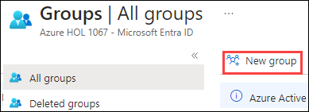
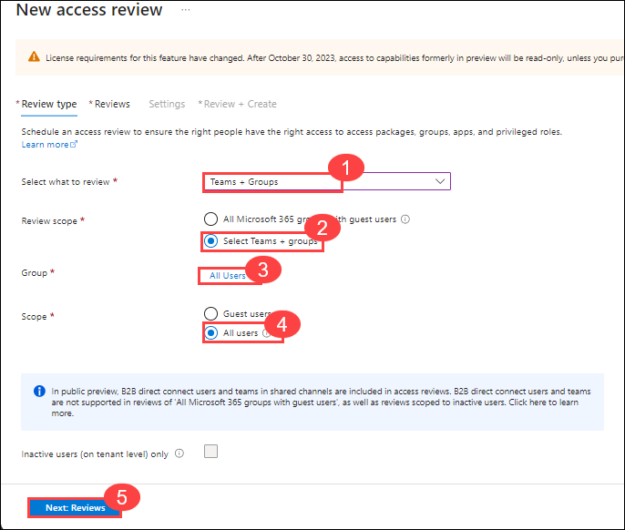
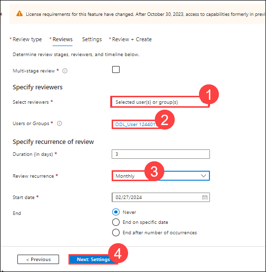
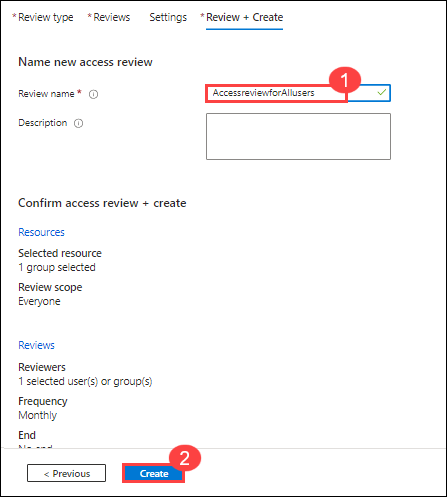
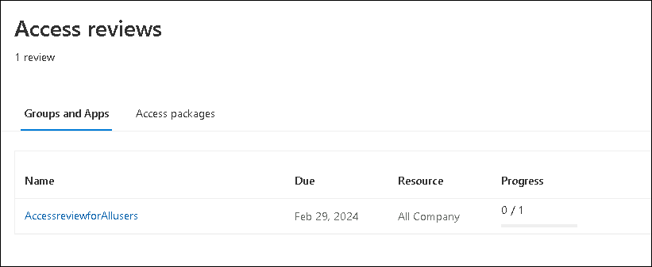
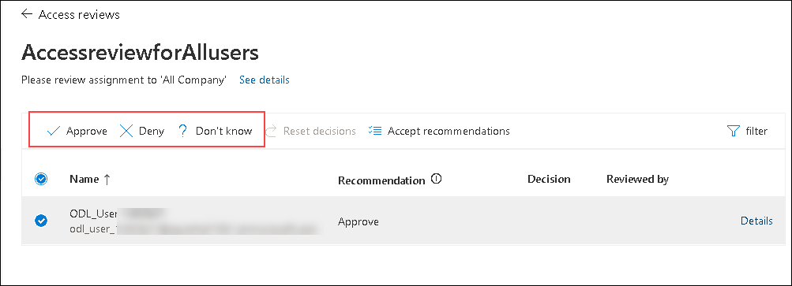
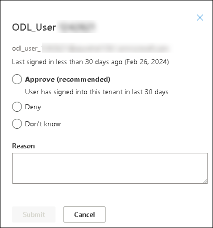
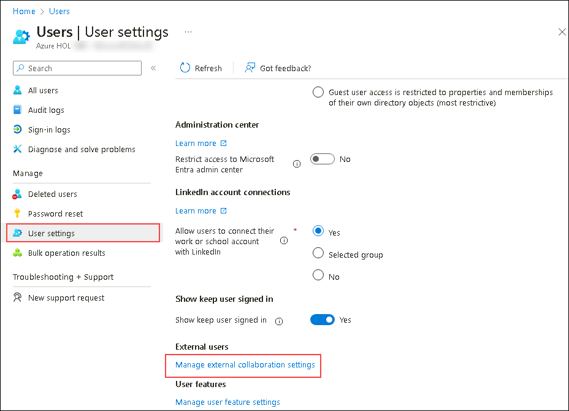
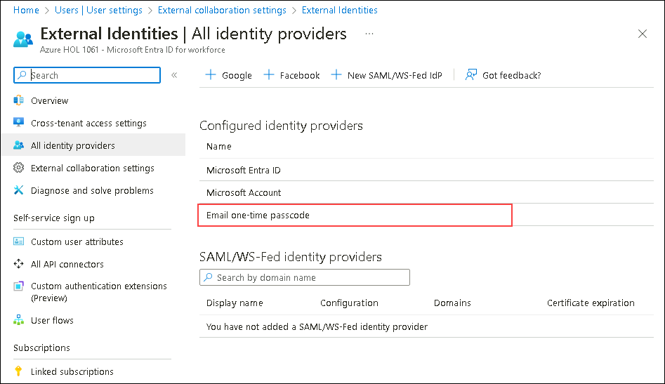

# Lab 6: Configure Access reviews and external collaboration setup

## Lab Overview 
This lab focuses on setting up access reviews to ensure proper management of user permissions within Microsoft Entra ID, enhancing security and compliance. By creating groups and configuring access reviews, administrators can regularly monitor and adjust user access to Teams and Groups, optimizing resource allocation while minimizing security risks.

## Lab Scenario
In this lab scenario, you are tasked with setting up a corporate IT environment, administrators aim to enhance security and streamline collaboration through access reviews and external collaboration settings within Microsoft Entra ID. By configuring access reviews, they ensure that user permissions for Teams and Groups are regularly reviewed and updated, maintaining optimal security posture.

## Lab objectives
In this lab, you will perform the following:

- Exercise 1: Configure Access reviews
  - Task 1: Create a group
  - Task 2: Configure access review
  - Task 3: Review access to groups and applications in access reviews
- Exercise 2: Configure external collaboration settings
  - Task 1: Enable Guest Users to perform self service sign-up
  - Task 2: Configure external collaboration settings

## Exercise 1: Configure Access reviews

### Task 1: Create a group

1. Navigate back to **Azure** portal and search and select **Groups**

1. click on **+ New group**

   

1. Create a group based on the below settings

   | Setting | Value |
   |----------|--------|
   | Group type | Microsoft 365 |
   | Group name | All Users |
   | Group description | Similar access group |
   | Microsoft Entra roles can be assigned to the group | yes |
   | Owners | Click on **no owners selected** and select **ODL_User** from the list |
   | Members | Click on **no members selected** and select **Allan**, **Jonis**, **Mirinda**, **Edmund** and also include **ODL_User** from the list |

   

1. Click on **Create** and select **Yes**

### Task 2: Configure access review

In this task, you will configure an access review in Microsoft Entra ID to review access permissions for Teams and Groups. The access review will include all users and will recur monthly. Reviewers will be selected from a specific user group, and notifications will be sent to all users at the end of the review. The review will auto-apply results to resources and take recommendations if reviewers don't respond. Ensure the settings are accurate before creating the access review.

1. On the **Azure portal**, search and select **Microsoft Entra ID** then select **Identity governance** under **Manage** section .

1. From the left navigation pane expand and select **Access reviews**.

1. Select **+ New access review**.

1. On **New access review** page, provide the below settings

   | Setting | Value |
   |--------|------|
   | Select what to review | Teams + Groups (1)|
   | Review scope | select Teams + groups (2)|
   | Groups | search and select **All users** from the list (3)|
   | Scope | All users (4)|

   

1. Select **Next:Reviews**

   | Setting | Value |
   |--------|------|
   | Select reviewers | Selected user(s) or group(s) |
   | Users or groups | click **+ Select Reviewers** and select **ODL_USER XXXX** from the list |
   | Review Recurrence | Monthly |

   

1. Select **Next:Settings**

   | Setting | Value |
   |--------|------|
   | Auto apply results to resource | Selected the checkbox |
   | if reviewers dont respond | Take recommendation |
   | At end of review, send notification to | click **+ Select User(s) or group(s)** and select **ODL_USER XXXX** from the list  |

   

1. Select **Next:Review + Create** and enter **AccessreviewforAllusers** to the **Review name**

   

1. Verify the settings once again and select **Create** to create the access review.

### Task 3: Review access to groups and applications in access reviews

1. Sign in to My Access at https://myaccess.microsoft.com/
   
1. On the **Pick an account** page, select **<inject key="AzureAdUserEmail"></inject>**.

1. Select **Access reviews** from the left menu to see a list of pending access reviews assigned to you.

   

1. After you open My Access under Groups and Apps, you can see:

      * Name: The name of the access review.
      * Due: The due date for the review. After this date, denied users could be removed from the group or app being reviewed.
      * Resource: The name of the resource under review.
      * Progress: The number of users reviewed over the total number of users part of this access review.

1. Select the name of the  access review that you created to get started.

1. After it opens, you'll see the  of user in the scope for the access review.

1. There are two ways that you can approve or deny access:

    - You can manually approve or deny access for one or more users.
    - You can accept the system recommendations.

1. **Manually review access for one or more users** - follow the below steps

    - Review the list of users and decide whether to approve or deny their continued access.

    - Select one or more users by selecting the circle next to their names.

    - Select Approve or Deny on the bar.

    - If you're unsure if a user should continue to have access, you can select Don't know. The user gets to keep their access, and your choice is recorded in the audit logs. Keep in mind that any information you provide is available to other reviewers. They can read your comments and take them into account when they review the request.

    - The administrator of the access review might require you to supply a reason for your decision in the Reason box, even when a reason isn't required. You can still provide a reason for your decision. The information that you include is available to other approvers for review.

     - Select Submit.

    - You can change your response at any time until the access review has ended. If you want to change your response, select the row and update the response. For example, you can approve a previously denied user or deny a previously approved user.

      

1. **Review access based on recommendations** - Follow the below steps

    -  Click on **Details** next to the access review.
     
    - To make access reviews easier and faster for you, Azure provides recommendations that you can accept with a single selection. There are two ways that the system generates recommendations for the reviewer. One method is by the user's sign-in activity. If a user has been inactive for 30 days or more, the system recommends that the reviewer deny access.

    - The other method is based on the access that the user's peers have. If the user doesn't have the same access as their peers, the system recommends that the reviewer deny that user access.

    - If you have No sign-in within 30 days or Peer outlier enabled, follow these steps to accept recommendations:

    - Select one or more users, and then select Accept recommendations Or to accept recommendations for all unreviewed users, make sure that no users are selected and then select the Accept recommendations button on the top bar.

    - Select Submit to accept the recommendations.

      

## Exercise 2: Configure external collaboration settings

### Task 1 - Enable Guest Users to perform self service sign-up

1. Sign in to the https://entra.microsoft.com

1. On the **Pick an account** page, select **<inject key="AzureAdUserEmail"></inject>**.

1. Select **Identity** then select **Users**.

1. Open the **All users** menu item, then select **User Settings**. and select **Manage external user collaboration settings**.
   
    

1. Ensure that **YES** is marked for the setting Enable guest self-service sign up via user flows.

1. Select **Save** at the top of the screen.

### Task 2 - Configure external collaboration settings

1. From the left navigation pane, under **Identity** select **External Identities**, and then select All identity providers.

1. Select the **Email one-time passcode** notification link you see near the top of the screen.

   

   >**Note:** A one-time passcode is a very secure way to invite a user to join your organization.

1. Ensure that **Yes** is selected.
1. Select **Save** if needed.

1. Select **External Collaboration Settings** on the left navigation pane.

1. Under **Guest user access**, review access levels that are available and then select **Guest user access is restricted to properties and memberships of their own directory objects (most restrictive)**.

   >**NOTE:**

      - Guest users have the same access as members (most inclusive): This option gives guests the same access to Microsoft Entra resources and directory data as member users.
      - Guest users have limited access to properties and memberships of directory objects: (Default) This setting blocks guests from certain directory tasks, like enumerating users, groups, or other directory resources. Guests can see membership of all non-hidden groups.
      - Guest user access is restricted to properties and memberships of their own directory objects (most restrictive): With this setting, guests can access only their own profiles. Guests are not allowed to see other users’ profiles, groups, or group memberships.
Screen image displaying guest user access restriction options

1. Under **Guest invite settings**, select **Member users and users assigned to specific admin roles can invite guest users including guests with member permissions!**

   >**NOTE:**

      - Anyone in the organization can invite guest users including guests and non-admins (most inclusive): To allow guests in the organization to invite other guests including those who are not members of an organization, select this radio button.
      - Member users and users assigned to specific admin roles can invite guest users including guests with member permissions: To allow member users and users who have specific administrator roles to invite guests, select this radio button.
      - Only users assigned to specific admin roles can invite guest users: To allow only those users with administrator roles to invite guests, select this radio button. The administrator roles include Global Administrator, User Administrator, and Guest Inviter.
      - No one in the organization can invite guest users including admins (most restrictive): To deny everyone in the organization from inviting guests, select this radio button.
      - If Members can invite is set to No and Admins and users in the guest inviter role can invite is set to Yes, users in the Guest Inviter role will still be able to invite guests.

1. Under **Collaboration restrictions**, review the available options and accept the default settings.

    >**IMPORTANT**

      - You can create either an allow list or a deny list. You can’t set up both types of lists. By default, whatever domains are not in the allow list are on the deny list, and vice versa.
      - You can create only one policy per organization. You can update the policy to include more domains, or you can delete the policy to create a new one.
      - The number of domains you can add to an allow list or deny list is limited only by the size of the policy. The maximum size of the entire policy is 25 KB (25,000 characters), which includes the allow list or deny list and any other parameters configured for other features.
      - This list works independently from OneDrive for Business and SharePoint Online allow/block lists. If you want to restrict individual file sharing in SharePoint Online, you need to set up an allow or deny list for OneDrive for Business and SharePoint Online.
      - The list does not apply to external users who have already redeemed the invitation. The list will be enforced after the list is set up. If a user invitation is in a pending state, and you set a policy that blocks their domain, the user’s attempt to redeem the invitation will fail.

1. When finished, **save** your changes.
